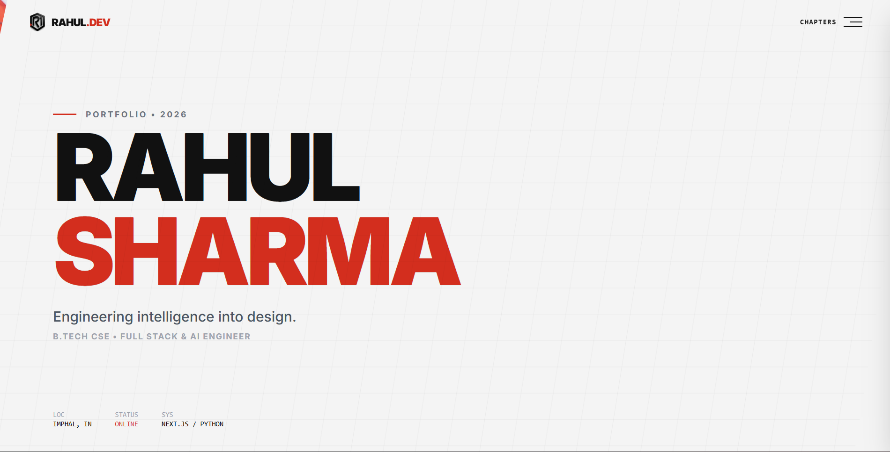

# Rahul Sharma | Portfolio 2026



Website Link: [https://rahul.aishtrex.com](https://rahul.aishtrex.com/)

> **"Engineering intelligence into design."**

A high-performance personal portfolio website built for speed, precision, and aesthetics.  
This project bridges the gap between **Silicon Logic (AI/Backend)** and **Human Emotion (UI/UX)**, featuring an **F1-inspired “Telemetry” design system**.


---

## Key Features

- **Smooth Scrolling**  
  Integrated **Lenis** for buttery smooth, momentum-based scrolling that syncs perfectly with animations.

- **Dynamic Navigation**  
  Smart Navbar detects background brightness using `elementFromPoint` and automatically switches text color (black/white) for perfect contrast.

- **🏎️ F1 "Telemetry" Design System**  
  Custom UI inspired by racing dashboards — system diagnostics, skill bars, slanted overlays, and data-driven layouts.

- **Advanced Animations**  
  Complex **GSAP + ScrollTrigger** timelines for staggered text, parallax motion, and immersive section reveals.

- **Audio Feedback**  
  Interactive **engine-start sound** triggered on Resume download for tactile feedback.

- **Performance Monitoring**  
  Pre-configured **Vercel Analytics** and **Speed Insights** for real-time performance tracking.

- **Fully Responsive**  
  Optimized from mobile screens to ultra-wide 4K displays.

---

##  Tech Stack

### Core
- **Next.js 14 (App Router)**
- **TypeScript**
- **React**

### Styling & Animation
- **Tailwind CSS**
- **GSAP (GreenSock)**
- **Lenis (Studio Freight)**

### Deployment
- **Vercel**

---

##  Getting Started

### 1️⃣ Clone the repository
```bash
git clone https://github.com/rahulsiiitm/portfolio-2026.git
cd portfolio-2026
```

### 2️⃣ Install dependencies
```bash
npm install
# or
yarn install
```

### 3️⃣ Run the development server
```bash
npm run dev
```

### 4️⃣ Open locally
Visit:  
-> http://localhost:3000

---

##  Project Structure

```bash
├── app/
│   ├── components/
│   │   ├── Hero.tsx              # Slanted overlay & WebP background
│   │   ├── Navbar.tsx            # Dynamic color-switching + smooth scroll
│   │   ├── About.tsx             # Telemetry stats, audio trigger, skill bars
│   │   ├── Projects.tsx          # Project showcase
│   │   ├── TechStack.tsx         # Infinite marquee of skills
│   │   ├── SmoothScrolling.tsx   # Lenis provider wrapper
│   │   └── ...
│   ├── globals.css               # Tailwind + custom fonts
│   ├── layout.tsx                # Global layout + Analytics
│   └── page.tsx                  # Main entry point
├── public/
│   ├── livery.webp               # Optimized hero background
│   ├── engine-start.mp3          # Interaction sound
│   └── ...
└── ...
```

---

##  Design Philosophy

Inspired by **Formula 1 engineering precision**:

- **Typography**  
  Bold uppercase headers with monospaced data text.

- **Color Palette**  
  Carbon Black, Off-White, Racing Red (`#FF0000`).

- **Motion Language**  
  Fast, non-linear easing curves (`power4.out`) to simulate acceleration and deceleration.

---

##  Author

**Rahul Sharma**  
B.Tech CSE • Full Stack & AI Engineer  

📍 Imphal, India  
🟢 Status: **ONLINE**

Built with 🏎️ and ☕ by Rahul Sharma.
