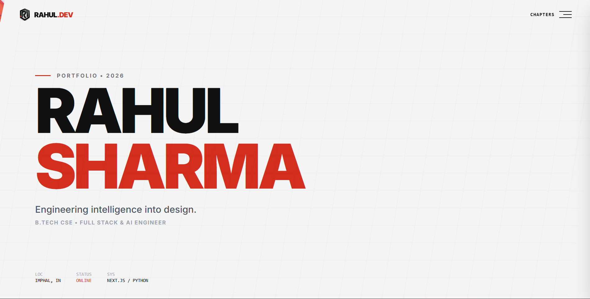

<div align="center">
  

  <br />
  <h1>Rahul Sharma — Portfolio</h1>
  <p><strong>Personal portfolio for my work across AI engineering, software, product design, and interactive web experiences.</strong></p>

  <p>
    <a href="https://rahul.aishtrex.com"><strong>Live Website</strong></a>
  </p>

  <p>
    
    
    
    
    
    
  </p>
</div>

## Overview

This repository powers my personal website at **rahul.aishtrex.com**.

The site is built as more than a static portfolio. It combines project storytelling, motion design, custom interaction systems, and an AI assistant into one cohesive experience. The visual direction is influenced by modern motorsport/editorial interfaces: clean grids, slanted geometry, restrained motion, strong typography, and a focused red accent.

The goal is simple: make the portfolio feel engineered, not templated.

---

## Highlights

### Portfolio Experience
- Responsive project showcase with dedicated project pages.
- Custom grid and slanted visual language used across the site.
- GSAP-powered motion and scroll interactions.
- Lenis smooth scrolling for consistent movement across sections.
- Dynamic navigation and responsive layouts for desktop and mobile.

### ZERO — Portfolio AI Assistant
The portfolio includes **ZERO**, a personal AI chatbot backed by the separate [`rahul-ai`](https://github.com/rahulsiiitm/rahul-ai) repository.

ZERO can answer questions about my work, projects, experience, and technical background directly from the site.

The frontend includes:
- streaming chat responses,
- persistent conversation state,
- responsive chat UI,
- graceful backend error handling,
- integration with the standalone ZERO backend.

### ZERO Control
A private `/zero-control` observability interface is included for monitoring the chatbot.

It provides visibility into:
- chat sessions,
- stored messages,
- provider usage,
- response latency,
- failures and events,
- inbound leads.

Access is protected using Supabase authentication and Row Level Security.

---

## Tech Stack

### Frontend
- **Next.js 16.1.2**
- **React 19.2.3**
- **TypeScript**
- **Tailwind CSS**

### Motion & Interaction
- **GSAP**
- **Framer Motion**
- **Lenis**
- **Lucide React**

### AI Integration
- **Vercel AI SDK**
- **ZERO backend API**

### Observability & Platform
- **Supabase** for Control Room authentication and telemetry access
- **Vercel Analytics**
- **Vercel Speed Insights**
- **Vercel** for deployment

---

## Project Structure

```text
portfolio/
├── app/
│   ├── components/          # Main portfolio UI and shared components
│   ├── projects/            # Individual project pages
│   ├── zero-control/        # Private ZERO observability interface
│   ├── globals.css          # Global styles and portfolio grid system
│   ├── layout.tsx           # Global application layout
│   └── page.tsx             # Main portfolio entry point
├── data/                    # Portfolio/project data
├── public/                  # Static assets
├── image.png                # README preview image
├── LICENSE                  # Proprietary license
└── package.json
```

---

## Running Locally

```bash
# Clone the repository
git clone https://github.com/rahulsiiitm/portfolio.git
cd portfolio

# Install dependencies
npm install

# Start the development server
npm run dev
```

Then open:

```text
http://localhost:3000
```

Some features such as ZERO and ZERO Control require their respective environment variables and backend services to be configured.

---

## Related Repository

### [`rahul-ai`](https://github.com/rahulsiiitm/rahul-ai)
Backend and local AI tooling for ZERO, including the FastAPI service used by this portfolio.

---

## Design Direction

The interface follows a restrained motorsport-inspired system rather than a traditional developer portfolio aesthetic:

- off-white and graphite surfaces,
- racing red accent `#D62E37`,
- skewed grid geometry,
- compact editorial typography,
- subtle rhombus and slanted SVG details,
- motion used to support hierarchy instead of decorating every element.

---

## Author

**Rahul Sharma**  
AI Engineer · Software Developer · Product Designer

- Website: [rahul.aishtrex.com](https://rahul.aishtrex.com)
- GitHub: [github.com/rahulsiiitm](https://github.com/rahulsiiitm)
- LinkedIn: [linkedin.com/in/rahulsharma2k4](https://linkedin.com/in/rahulsharma2k4)

---

## License

This project is **proprietary**. All rights reserved.

The source code, design system, visual assets, branding, content, and related materials may not be copied, modified, redistributed, deployed, or reused without explicit written permission.

See the [LICENSE](LICENSE) file for the full terms.
